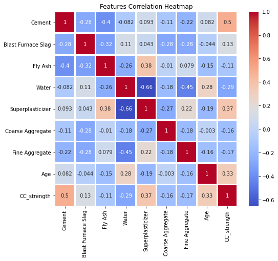
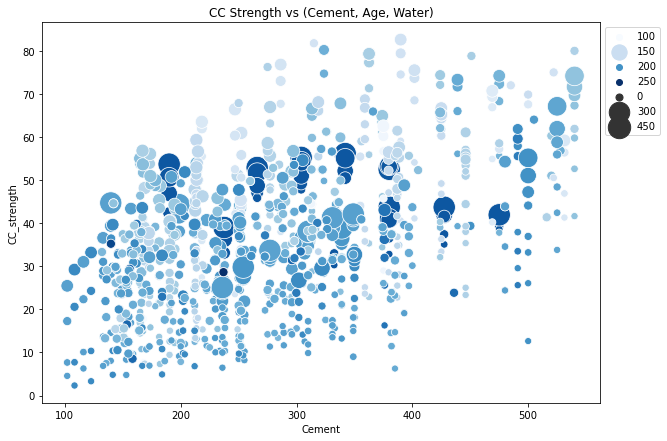
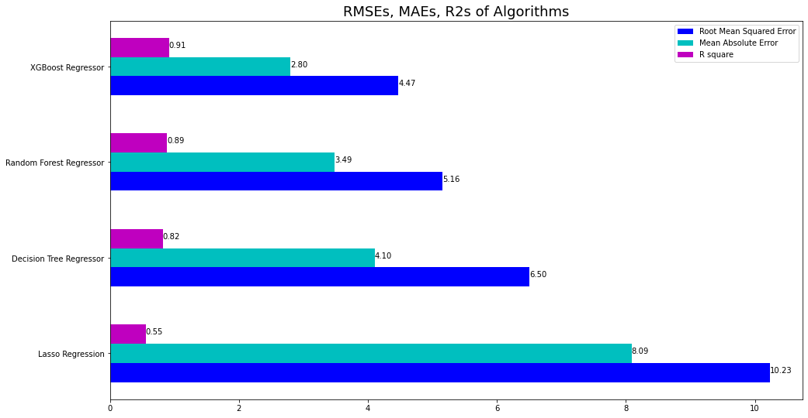
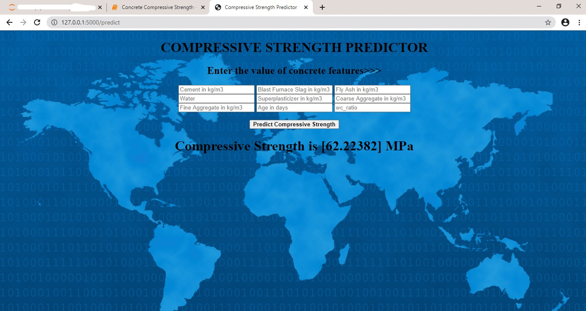

# Compressive Strength Prediction : Project Overview

 The conventional process of testing the compressive strength of concrete involves casting several cubes for the respective grade (M10, M15 etc.) and observing the strength of the concrete over a period of time ranging from 7 to 28 days.Various combinations of the components of concrete are selected and cubes for each combination are casted and its strength at 1, 3, 7, 14 and 28 days is noted down. This is a time consuming and rather tedious process.

 Hence, to conserve time and energy, I decided to use my domain knowledge and apply it to data science to predict the compressive strength of concrete given various factors effecting it.
   
- Created a tool that estimates the Compressive strength of concrete with 91% accuracy and a mean absolute error of 2.8 MPa to save time and energy of waiting for 28 or more days according to the requirements.

- Engineered features and created a new feature as water-cement ratio which is considered as an important factor which effects the compressive strength of concrete.

- Built the model after comparing various models which predicted the values with a mean absolute error of 2.8 MPa.

- Deployed the model as a website on local machine using flask and html. 

## Code and resources used

Dataset is obtained from https://archive.ics.uci.edu/ml/datasets/Concrete+Compressive+Strength

Html website built by viewing the model deployment video on youtube by "Indian AI Production"

Python Version: 3.8

Packages: pandas, numpy, sklearn, matplotlib, seaborn, flask, json, pickle, html.

## Dataset

- Number of instances (observations): 1030

- Number of Attributes: 9

8 quantitative input variables:

   - Cement

   - Blast Furnace Slag

   - Fly Ash

   - Water

   - Superplasticizer

   - Coarse Aggregate

   - Fine Aggregate

   - Age (in days)

   All features above except age are in kg/m3

- 1 quantitative output variable:

   Concrete Compressive Strength (Mpa)

## EDA

Looked at the distributions of the data for the various variables and created a new feature water-cement ratio. Below are a few highlights from the exploratory data analysis.

## Model Building

Tried the data for Linear, Ridge, Lasso, Support Vector, Decision Tree, Random Forest and XGBoost Regressor models. Of them, Random forest and XGBoosts were standouts. Did the cross validation and attained results as shown in the image below.

## Productionization

In this step, a flask API was built that was hosted on a local webserver as a website. It took input values of features and showed the predicted value of compressive strength in MPa. The screenshot of how the website looked is as shown below.

